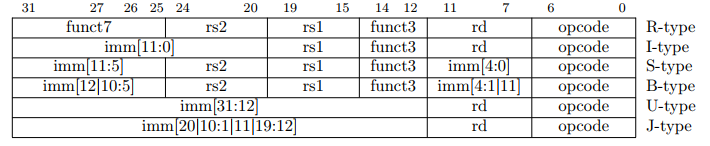

# RISCV-CPU

## 参考图片

## 日志

- 260415：修改ControlUnit.v，有待验证与继续修改
- 260416：修改RF.v r0，增加注释，补充RTL文件分析，补充README
- 260417：修改IM.v为时序逻辑，修改ControlUnit.v状态机。问题在于InstrMem改为同步读取后，InstrReg需在下一周期才能读取正确指令。添加状态机将地址发出与指令锁存分到两个时钟周期完成
- 260418：修改DM.v为同步写异步读
- 260419：修复ALU分支缺失
- 260420：更新多周期架构，修改了部分连线，有待验证

## 注意事项

- IM.v用提供的memory替换（/home/library/tsmc65lp SRAM 2048*64 tt ? 后端时需要初赛不需要）
- 添加模块最好加在子模块中
- 已有连线不再改动，可修改连线名字
- 不修改原有port位宽，可增加input/output
- 不修改`include内容，可新增

## 指令类型

- R型（寄存器运算） `INSTR_RTYPE_OP`
    - ADD
    - SUB
    - AND
    - OR
    - XOR
    - SLL
    - SRL
    - SRA
- I型（立即数运算/加载/寄存器跳转）
    - `INSTR_ITYPE_OP`
        - ADDI
        - ORI
    - LW
    - JALR
- S型（存储）
    - SW
- B型（条件分支）`INSTR_BTYPE_OP`
    - BEQ
    - BNE
- J型（无条件跳转）
    - JAL

## 仿真方法：
- 在/target/riscv_cpu_design/sim目录执行`make`,仿真结束后sim文件夹下出现novas.fsdb的波形文件，继续在相同目录执行`verdi -ssf novas.fsdb &`，在新窗口的signal下拉窗口选择Get All Signals即可观察到波形.
