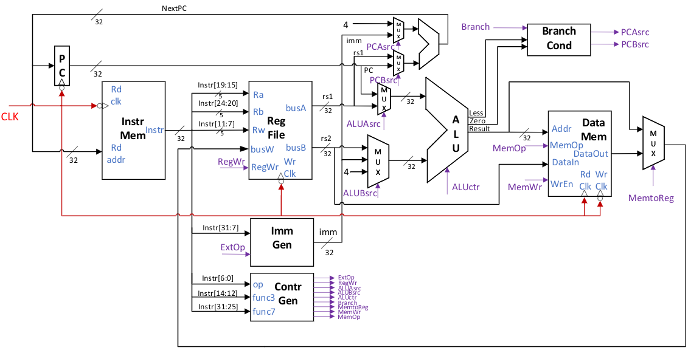

# RISCV-CPU

## 参考图片

## 日志

- 260415：修改ControlUnit.v，有待验证与继续修改
- 260416：修改RF.v r0，增加注释，补充RTL文件分析，补充README

## 其他待修改（总结钉钉问题）

- ControlUnit.v JALR指令的NextPC = (rs1寄存器值 + 符号扩展(I型立即数)) & ~32'd1，代码中只提供rs
- IM.v改为同步memory访问，添加clk端口，改为时序逻辑，用提供的memory替换（/home/library/tsmc65lp SRAM 2048*64 tt ? 后端时需要初赛不需要）
- IR.v可改为组合逻辑实现，可最后实现
- 添加模块最好加在子模块中
- 已有连线不再改动，可修改连线名字
- 不修改原有port位宽，可增加input/output
- 不修改`include内容，可新增

## 指令类型
- R型（寄存器运算） `INSTR_RTYPE_OP`
    - ADD
    - SUB
    - AND
    - OR
    - XOR
    - SLL
    - SRL
    - SRA
- I型（立即数运算/加载/寄存器跳转）
    - `INSTR_ITYPE_OP`
        - ADDI
        - ORI
    - LW
    - JALR
- S型（存储）
    - SW
- B型（条件分支）`INSTR_BTYPE_OP`
    - BEQ
    - BNE
- J型（无条件跳转）
    - JAL
