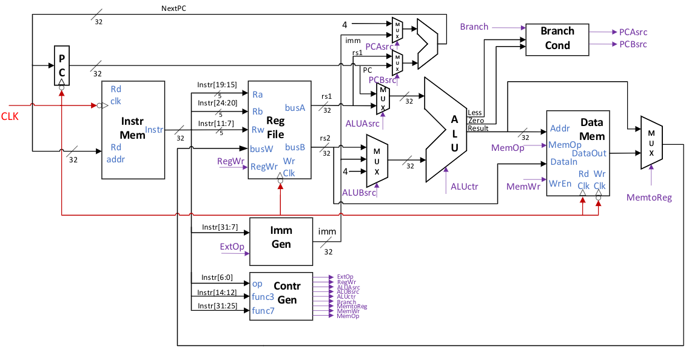

# RISCV-CPU

## 参考图片


## 日志

- 260415：修改ControlUnit.v，有待验证与继续修改
- 260416：修改RF.v r0，增加注释，补充RTL文件分析，补充README
- 260417：修改IM.v为时序逻辑，修改ControlUnit.v状态机。问题在于InstrMem改为同步读取后，InstrReg需在下一周期才能读取正确指令。添加状态机将地址发出与指令锁存分到两个时钟周期完成
- 260418：修改DM.v为同步写异步读
- 260419：修复ALU分支缺失
- 260420：更新多周期架构，修改了部分连线，有待验证
- 260424：修改顶层与相关信号，DM.v读出打拍，RF.v r0特殊处理，NPC JALR逻辑修改
- 260517：接入测试框架，jal实现有问题，继续修改
- 260526：多周期架构基本完成，测试通过。
    - 增加ImmGen模块，负责立即数生成
- 260526：修改为流水线架构，测试通过。

## 仿真方法：
- 在/target/riscv_cpu_design/sim目录执行`make`,仿真结束后sim文件夹下出现novas.fsdb的波形文件，继续在相同目录执行`verdi -ssf novas.fsdb &`，在新窗口的signal下拉窗口选择Get All Signals即可观察到波形.


## 测试方法：
在 WSL/Linux 下运行：
```bash
cd /mnt/.../RISCV-CPU/student_cpu_tests_minimal
make clean
make build
make run TEST=addi
python3 run_all_tests.py
```

单个测试：
```bash
make run TEST=addi
make run TEST=jal
make run TEST=beq
```
全部测试：
```bash
make build
python3 run_all_tests.py
```